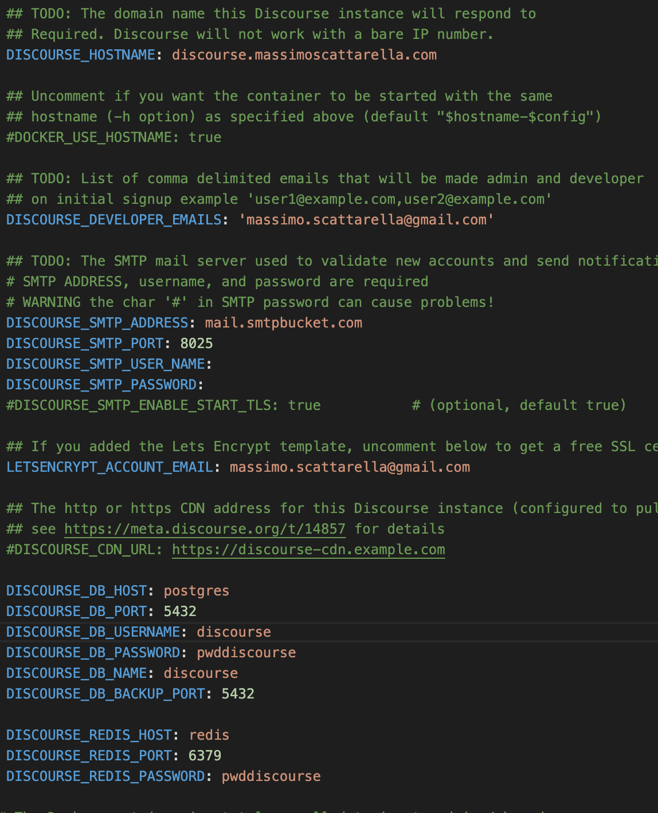
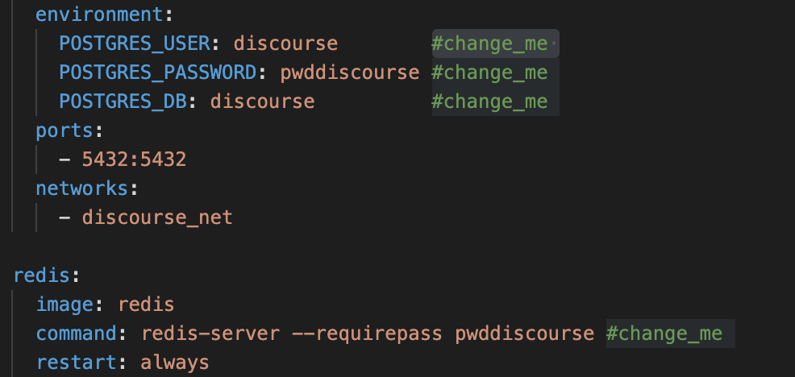

# Discourse

## Prerequisiti
- docker
- docker-compose

## Setup
1. Modificare il file ./discourse/container/app.yml con le proprie configurazioni.

    

2. Modificare i valori messi nel file precedente anche nel docker-compose nei punti indicati dal commento `#change_me `
    

3. Run
    ```
    docker-compose up
    ```

    A questo punto viene eseguita la build di un immagine la quale viene usata per buildare un altra immagine di `Discourse` aggiornata che verra' eseguita alla fine. 

    Per aggiornare basta rilanciare il compose solo per la parte di discourse altrimenti si potrebbe modificare per usare i comandi ./launcher stop/start/.....
    
    Fonte : [Documentazione GitHub](https://github.com/discourse/discourse_docker)

    In questo esempio ho usato un smtp free [SmtpBucket](https://www.smtpbucket.com/) quindi una volta scelta la mail inserire nel campo `Recipient` la mail ed attendere.

    Per il dominio usarne uno pubblico.